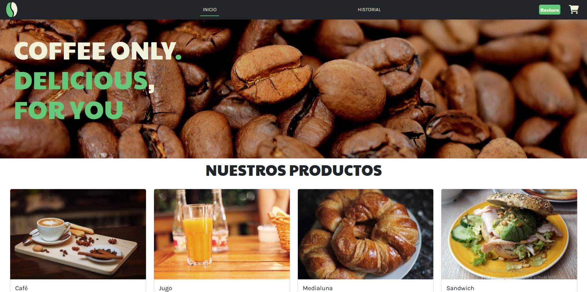

# Final project of the JS course by Coderhouse
## About this site :globe_with_meridians:

### CoffeeStore cart :coffee:
This project it's a shopping cart simulator.
It's made using vanilla JS.

The principle objective its to implement the basics of JS integrating it with asynchronous logic of the fetch() global method.
For this last topic, mockapi.io platform was used as database, since it provides two main tools:
* Simple interface to add resources.
* API to consult data.

_For more info visit **[mockapi.io](https://mockapi.io/docs)**_

### What it does :grey_question:
The main functionality it's add or remove products in your cart and therefore the program will calculate the subtotals and total of the check.
It also have some extras functionalities that I consider improves the UX:
* The disability of the adds buttons when you already have the corresponding product in your cart or when there's no product stock available.
* Small alerts will display when you reach the max stock available or when you try to remove less than 1 product unit.
* The DOM section where the cart is displayed disappears when you dont have any products in it.
* Confirmation alert displays when you click the buy button.
* Loading alert displays when requests are made.

### Design :black_nib:
The logo was taken from freepik and is [Designed by rawpixel.com / Freepik](http://www.freepik.com)

The color palette was selected by me. You can find the hex code of white, gray, red and green colors inside the following directories:

***"./src/ui/colorPallete.js"*** or in the root selector on ***".src/style.css"***

The dark is the default by Bootstrap

## Screenshot :iphone:

## Libraries :notebook_with_decorative_cover:
Some libraries were added via CDN to improve the UI, so npm install isn't required.

**Bootstrap** -->
https://getbootstrap.com/

**Toastify** -->
https://github.com/apvarun/toastify-js

**Sweetalert2** -->
https://github.com/sweetalert2/sweetalert2

## Topics :clipboard:

### Asynchrony :arrows_counterclockwise:
JSON file with products data are stored in mockapi.io "products" resource.
Also there is a "purchases" resource which is in charge of store the accomplished purchases. You can check this record in the "Historial" page.

Sometimes the requests can throw NetWork errors, just reload the page until the content is loaded.

Since anyone can send request to the endpoint (because there's no API key needed), a "Restore" button is in the header. The main function is to reset to default resource values, namely the stock of the items is back to 10, and the purchase record is deleted.

### Modularization :card_file_box:
The structure is based on MVC pattern design. Puedes ver que dentro de la carpeta src estan las carpetas ui and services which fulfill their responsabilities.
Due the project was growing while I adquiring more knowledge, it not follows strictly the pattern.

## Do you want to see the site??
### Check the -->[CoffeStore](https://manuelffernandez.github.io/coffe-shopping-cart/)<--

## Contact me :email:
### manufer6503@gmail.com
